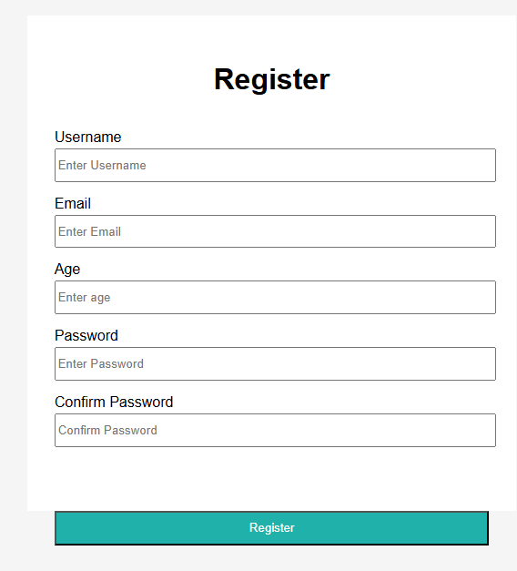

# Form registration project
A program that validates your information

##Features

-Enter your username,email,password,confirm password
-Click the Register button
-Gives you error msg and red borders depending on the input you had given
-Gives you green border its successfuland and shows you back what you have entered using Flask
-Applies to all field

## How to run

-Open the folders
-Open live server

## What I learned

-Js
-Html
-Css
-python Flask

